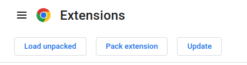

# click-gpt4

## Instalation 
1. `git clone https://github.com/Dovidaitis/gpt-4-redirect`
2. `cd` gpt-4-redirect
3. `rm` README.md
4. Go to *chrome://extensions/*

5. Enable Developer mode in your browser

6. Press Load unpacked

7. Select gpt-4-redirect directory
8. Enjoy